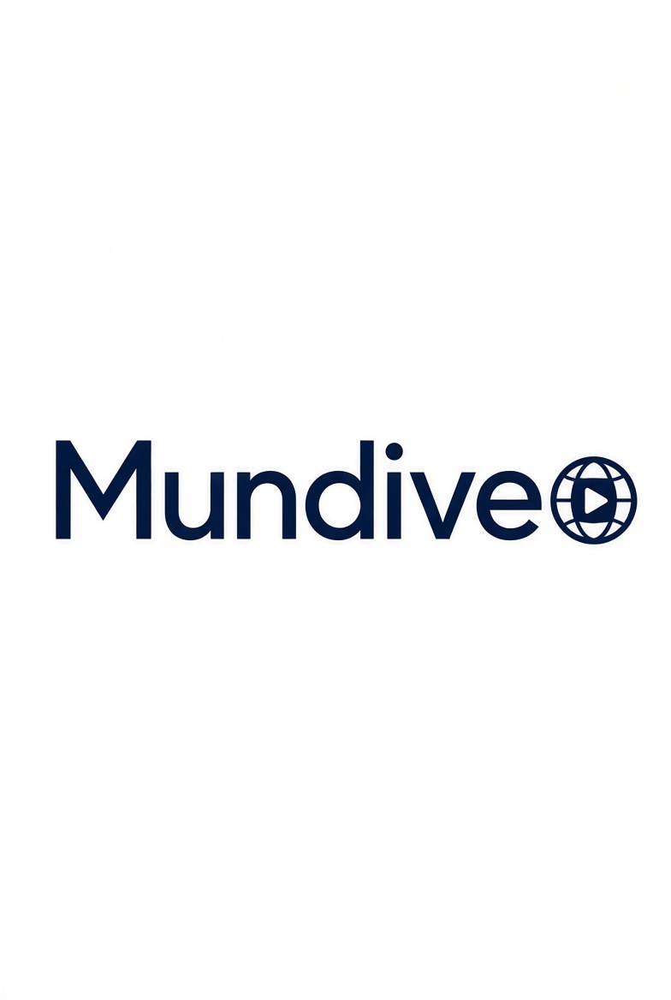

# MundiVeo



A European, community-governed video platform — built as an alternative to YouTube, under EU law by design, and documented in public from day one.

📺 This project is being built on camera. See the video series for the full story behind every decision.

## Where this project lives

As of September 2026, **Codeberg is the primary home for this repository** — an EU-based (Germany), non-profit, community-run Git host, chosen deliberately given MundiVeo's own GDPR-by-design and EU-sovereignty positioning. https://codeberg.org/Mundiveo-platform/Mundiveo_platform

This GitHub repository is kept as a public mirror for visibility and discoverability, since GitHub is where people already look — but active development, issues, and pull requests happen on Codeberg going forward.

## Status

🚧 **Concept / pre-MVP.** No production code yet. This repository exists to make the build process public from the start.

## What is this?

MundiVeo aims to combine:
- The ease of use people expect from YouTube
- EU-based hosting and GDPR-by-design data handling
- A semi-open governance model (community has real input, inspired by open-source projects like Linux)
- Transparent, explainable recommendations instead of a black-box algorithm
- Fairer monetization terms for creators

Project narrative & roadmap: [`docs/PROJECT_CONCEPT.md`](docs/PROJECT_CONCEPT.md)
Functional design (source of truth): [`docs/FUNCTIONAL_DESIGN.md`](docs/FUNCTIONAL_DESIGN.md)
Technical design (source of truth): [`docs/TECHNICAL_DESIGN.md`](docs/TECHNICAL_DESIGN.md)
Governance model (draft): [`docs/GOVERNANCE.md`](docs/GOVERNANCE.md)
Branding (logo + color palette): [`docs/BRANDING.md`](docs/BRANDING.md)
Public expenses log: [`EXPENSES.md`](EXPENSES.md)

Build spec for AI-assisted development: [`VIBE_CODE_BRIEF.md`](VIBE_CODE_BRIEF.md) — a generated summary of the FD/TD above. If it ever conflicts with the FD/TD, the FD/TD win.

## Repository structure

```
docs/
  PROJECT_CONCEPT.md    → Why, naming, deliberate scope decisions, roadmap
  FUNCTIONAL_DESIGN.md  → User roles, features, user flows (source of truth)
  TECHNICAL_DESIGN.md   → Stack, architecture, schema, API, recommendations (source of truth)
  GOVERNANCE.md         → Draft governance model
  BRANDING.md           → Logo + official color palette (source of truth)
assets/
  mundiveo-logo.jpg          → Official logo
  mundiveo-color-palette.jpg → Full palette reference image
EXPENSES.md             → Public cost log
frontend/               → React + TypeScript client
backend/                → Node.js + Express API
scripts/                → DB setup, transcoding helpers
```

## What's deliberately NOT in this version

To keep the first working version achievable and legally simple, the following are intentionally deferred — see `docs/PROJECT_CONCEPT.md` Section 3 for the reasoning:
- Adult (18+) content and age verification
- Decentralized/NAS-based storage
- Monetization payouts (schema exists, endpoints don't yet)

These may return via community governance decisions later — this isn't a permanent ban, just a sequencing choice.

## Contributing

This project doesn't have external contributors yet — it's just getting started. Once it does, contribution guidelines will live in `CONTRIBUTING.md`. Watching, starring, and opening discussion threads is welcome even now.

## License

See [`LICENSE`](LICENSE). **AGPL-3.0** — chosen specifically because MundiVeo is a network service, not distributed software: plain GPL-3.0 only triggers source-sharing on distribution, which a hosted platform never technically does (the well-known "SaaS loophole"). AGPL-3.0 closes that gap, requiring anyone who runs a modified version as a network service to also offer their source to users — keeping the project and any derivatives genuinely open. This also matches the license used by PeerTube and by Forgejo (which powers Codeberg, where this project is now primarily hosted).
